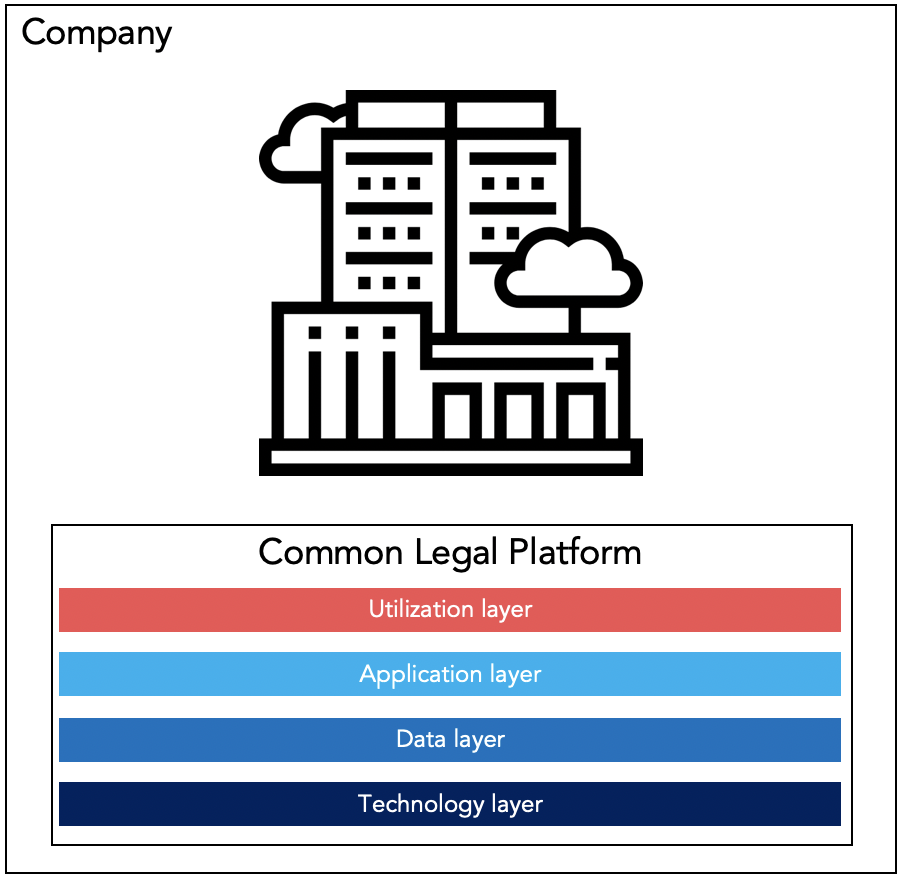

# Common Legal Platform – Platform Benefits

Publisher: **Liquid Legal Institute e.V.**  

### Table Of Contents
- [Preface](#preface)
- [CLP within a Company](#clp-within-a-company)
  - [A White-box View on the CLP within a Company](#a-white-box-view-on-the-clp-within-a-company)
- [CLP for Governments](#clp-for-governments)
  - [A White-box View on the CLP for Governments](#a-white-box-view-on-the-clp-for-governments)
- [Cross-Industry Synergies from the CLP](#cross-industry-synergies-from-the-clp)
- [The Liquid Legal Institute e.V.](#the-liquid-legal-institute-ev)
- [Imprint](#imprint)

## Preface

See Preface of [CLP Principles](https://github.com/Liquid-Legal-Institute/Common-Legal-Platform/blob/main/Principles.md#preface)

## CLP within a Company
Implementing the Common Legal Platform within an enterprise setup or a company allows to leverage many synergies arising in all areas of interaction, consumption, or offering of legal (of all facets) services. This is not only restricted to the legal department. Therefore, conceptualizing and implementing the four layers of the Common Legal Platform is not only beneficial for use cases and scenarios of in-house legal department but for the whole company. 

### A White-box View on the CLP within a Company

The four layers have something to offer for every department within a company, especially when it comes to collaboration or to processes and workflows that cross the boundaries (and responsibilities) of departments. Implementing the layers decrease the complexity of exchanging information and the harmonization of processes and workflows. Additionally, an implementation would allow for more efficient reuse of data. All together a seamless flow of information in workflows and processes, but also the exchange of information and maybe even the maintenance of commonly used data and assets (such as legal documents, contracts, clauses, etc.) will be enabled or handled more efficiently.  

The different layers sketch the level of abstractness on which collaboration and integration can occur. It might be on a low level of infrastructure and data assets (including knowledge) or on a higher level, such as applications that are commonly used or processes and workflows on the utilization layer.

## CLP for Governments
The Common Legal Platform with its four layers is attractive for governments and governmental authorities as well. As authorities often face the same or similar challenges as companies, when it comes up to digital transformation, the CLP can be an ideal conceptual or implementational framework. Therefore, the CLP is not at all restricted to companies from the private sector. In fact, as discussed below, many synergies will be leveraged once the CLP is adapted by many different players. 

### A White-box View on the CLP for Governments
Similarly, as the CLP contributes positively within companies, the CLP allows governmental authorities to streamline processes and data flows. New processes and workflows across authorities can be installed based on the interoperability of services and functionality arising from the four different layers. But also, more low-level, and less disruptive innovation is possible more easily, such as decreased effort in sharing data and information or other more technological resources. The reuse of (software) applications in similar scenarios, but other authorities is made possible as the CLP provides a common frame of references.  

## Cross-Industry Synergies from the CLP
Most synergies can be leveraged once the CLP is installed throughout cooperating and competing parties within the same market. The CLP streamlines the commonalities between companies and participants of the market.  

Therefore, important information can be shared seamlessly, and the participants can focus on the difficult and challenging parts of cooperation and competition, e.g., the negotiation of a contract is no longer delayed by annoying transfer of e-mails and very close inspection of possible changes the counterparty made. Instead, a common platform allows every party to work in the contract in parallel, and changes will be made visible instantly (or upon deployment). In such a scenario, commonly accepted standards, e.g., clauses and contract structure, can be reused easily. The negotiating parties can focus more on the legal and business aspects of the deal and must no longer deal with cumbersome and tedious pseudo-tasks.  

Another aspect can be discussed in the context of interaction with authorities. If data, e.g., legal documents, is published in a commonly accepted format and in easily accessible storages, legal monitoring and subsequent compliance processes can more efficiently react and adapt to new regulation. In addition, if companies and authorities share common interfaces the exchange of data, that needs to be shared anyway, e.g., reports, etc. can be done with less effort. Again, the overhead is decreased by agreeing on the Common Legal Platform, and businesses and governments are empowered to focus on their core business again. 

## The Liquid Legal Institute e.V.
The Liquid Legal Institute e.V. is a non-profit organization incorporated as a registered association (eingetragener Verein) under the laws of Germany. Its purpose, as defined in the articles of association, is to research and promote new ways of thinking and new technologies and other innovations in the legal ecosystem, i.e. so-called Legal Transformation. It is made up of members who belong to different stakeholder groups, including corporates, law firms, legal tech start-ups and individuals. 

> For more information about us and about what drives us visit www.liquid-legal-institute.org

## Imprint
Liquid Legal Institute e.V.  
Munich (Germany)

Office address:  
Almenrausch 25, 85521 Ottobrunn, Germany  
E-Mail: info@liquid-legal-institute.org

Management board in the terms of § 26 BGB: Kai Jacob (Chairperson), Dierk Schindler, Bernhard Waltl  
Executive director: Dierk Schindler  
Register of associations: Amtsgericht München  
Registration number: VR 207699  

